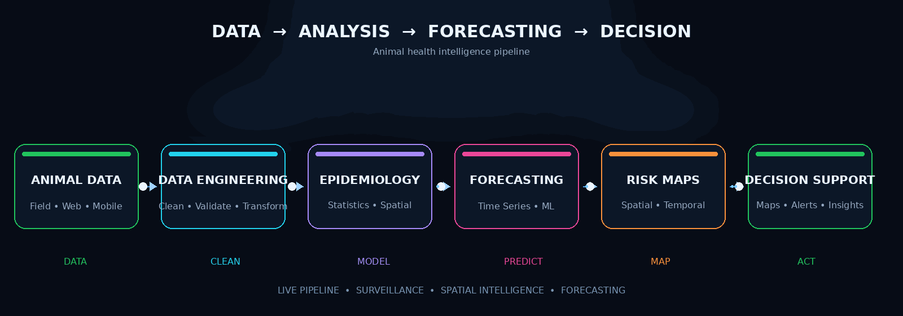

 

  

---

## 👨‍💻 About Me

I'm a **Computer Engineer and Software Developer** working across:

**Software Engineering • Data Engineering • GIS • Veterinary Epidemiology • Forecasting • Linux • HPC**

I build **web applications, databases, APIs, GIS workflows and scientific computing systems** that transform complex data into useful insights and decision-support tools.

---

## 🐄 Animal Health Intelligence

  

  
    Animal / Field Data → Data Engineering → Epidemiological Analysis →
    Forecasting → Risk Mapping → Decision Support
  

---

## 🧠 Core Expertise

<table>
<tr>
<td width="50%" valign="top">

### 📊 Data & Analytics

* Python
* R
* Pandas
* NumPy
* SQL
* Statistical Analysis
* Time-Series Analysis
* Data Processing
* Disease Forecasting
* Machine Learning

</td>

<td width="50%" valign="top">

### 🗺️ GIS & Epidemiology

* QGIS
* Google Earth Engine
* GDAL
* Spatial Statistics
* Remote Sensing
* Spatial Epidemiology
* Disease Risk Mapping
* Spatio-Temporal Analysis
* Environmental Analysis

</td>
</tr>

<tr>
<td width="50%" valign="top">

### 🌐 Software Development

* PHP
* JavaScript
* HTML5
* CSS3
* REST APIs
* MySQL
* MongoDB
* React Native
* Android

</td>

<td width="50%" valign="top">

### 🖥️ Infrastructure

* Linux
* Ubuntu
* Apache
* SSH
* SSL/TLS
* Docker
* Kubernetes
* Jenkins
* HPC
* Open OnDemand

</td>
</tr>
</table>

---

## ⚙️ Technology Stack

---

## 🔬 What I Build

| Area                              | Focus                                                 |
| --------------------------------- | ----------------------------------------------------- |
| 🧬 **Animal Epidemiology**        | Disease surveillance, forecasting, risk analysis      |
| 🗺️ **Spatial Intelligence**      | GIS, risk mapping, remote sensing, spatial statistics |
| 💻 **Software Systems**           | Web applications, APIs, dashboards, mobile apps       |
| 🗄️ **Data Engineering**          | Databases, processing, validation, automation         |
| 🖥️ **Scientific Infrastructure** | Linux, HPC, Open OnDemand, deployment                 |

---

## 🚀 Selected Work

### 🧬 NADRES

Animal disease reporting and epidemiological data management systems.

`PHP` `MySQL` `JavaScript` `R` `GIS` `Apache` `Linux`

### 📊 PDDES

Web and mobile based data collection and decision-support workflows.

`PHP` `MySQL` `JavaScript` `React Native` `Android` `REST API`

### 🗺️ Disease Risk Mapping

Combining epidemiological, environmental and geographic datasets to produce disease risk intelligence.

`Python` `R` `QGIS` `GEE` `GDAL`

### 🔮 Disease Forecasting

Time-series and predictive workflows for understanding disease trends and future risk.

`R` `Python` `Statistics` `Machine Learning`

### 🖥️ HPC / Open OnDemand

Linux-based scientific computing and research infrastructure.

`Linux` `Ubuntu` `Apache` `Open OnDemand` `SSH`

---

## 🔭 Currently Exploring

---

## 📐 My Workflow

---

## 💡 Engineering Philosophy

---

### `DATA → SCIENCE → INTELLIGENCE → ACTION`

 

  

<!--
Repository structure:

Navnath0006/
├── README.md
└── animal-disease-flow.gif
-->
